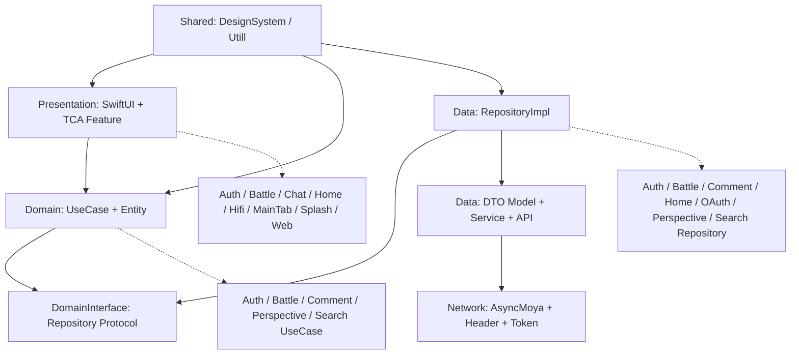
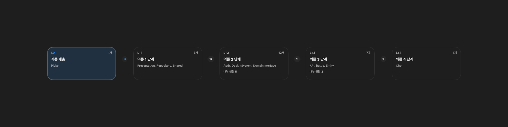
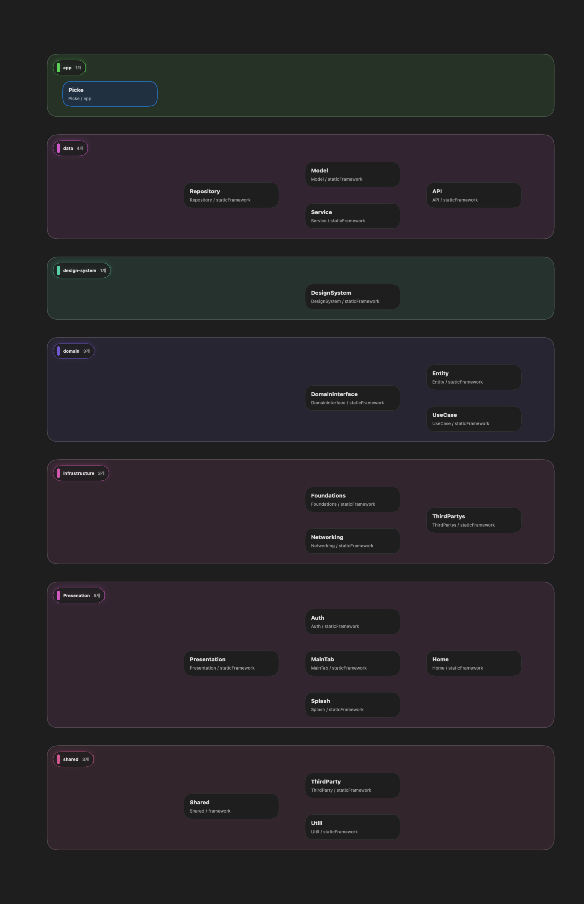

# Picke iOS

<div align="center">

**가치관 충돌에서 시작하는 1:1 철학 배틀 플랫폼, Picke**


[🎯 Features](#-주요-기능) | [🏗 Architecture](#-프로젝트-아키텍처) | [🚀 Quick Start](#-빠른-시작) | [🔐 OAuth Flow](#-oauth-인증-플로우)

---

</div>

## 📖 프로젝트 소개

**Picke** 는 일상의 가치관 차이를 1:1 토론으로 풀어내는 모바일 토론·투표 플랫폼입니다.
"오늘의 배틀" 주제에 대한 사전·사후 투표, 실시간 1:1 채팅 토론, 그리고 리캡 카드까지 한 흐름으로 이어집니다.

> 💡 **왜 만들었나?**
> SNS 의 단방향 의견 표출 대신, 짧고 명확한 1:1 토론을 통해
> "내가 왜 그렇게 생각하는지" 를 정리하고 다른 가치관을 마주하는 경험을 제공합니다.

## 🛠 Setup

### AI 도구 연동

프로젝트 규칙은 `AGENTS.md` / `CLAUDE.md` 에 정의되어 있습니다.

```bash
ln -s AGENTS.md CLAUDE.md
```

## ✨ 주요 기능

### 🔐 소셜 로그인 (server-mediated OAuth)
- **Google / Kakao**: WKWebView 기반 `authorize → code 가로채기` → 백엔드 토큰 교환
- **Apple Sign-In**: `ASAuthorizationAppleIDProvider` 네이티브 통합
- **자동 토큰 갱신**: `AccessTokenCredential` JWT exp 디코딩 + 만료 5분 전 자동 refresh
- **401 자동 처리**: `AuthInterceptor` 가 401 감지 → refresh 시도 → 실패 시 자동 로그아웃 알림 발송

### 🥊 오늘의 배틀
- **사전 투표 → 1:1 채팅 토론 → 사후 투표** 의 한 흐름
- **재투표** 로 가치관이 바뀌었는지 추적
- **리캡 카드** 자동 생성 + 공유
- **채팅방 오디오 재생** + 로딩 실패 시 상단 floating 오류 배너(`FloatingErrorView`)

### 💬 토론 / 관점(댓글)
- 채팅방형 1:1 음성 토론
- 관점(=댓글) 등록·수정·삭제 + 대댓글, 좋아요, 신고
- 투표 진영(optionId)별 관점 등록 / 진영 탭 필터
- 본인 글 "나" 표시 + 수정·삭제 메뉴, 등록·갱신 시 스켈레톤

### 🧭 탐색 / 큐레이팅 / 홈
- 큐레이팅된 홈 피드
- **흥미 기반 배틀 추천**(큐레이팅 화면) — `GET /battles/{id}/recommendations/interesting`
- 카테고리·태그 탐색
- 토픽 검색

### 👤 마이페이지
- 내 콘텐츠 활동 / 토론 기록
- 나의 철학자 유형
- 포인트 내역 / 알림 / 설정

## 🏗 프로젝트 아키텍처

### 🎯 Clean Architecture × Tuist 멀티 모듈

```
Picke-iOS/
├── 📱 Projects/
│   ├── App/                       # 메인 애플리케이션 타겟
│   │   ├── Sources/
│   │   │   ├── Application/       # AppDelegate, SceneDelegate
│   │   │   ├── Di/                # WeaveDI 등록 (DiRegister, AppPresentationContextProvider)
│   │   │   ├── Reducer/           # TCA Root AppReducer
│   │   │   └── View/              # Root Views
│   │   └── Derived/               # Tuist 생성 plist
│   │
│   ├── Presentation/              # 🎨 UI Layer
│   │   ├── Auth/                  # 로그인 / 온보딩 / 인증 코디네이터
│   │   ├── Battle/                # 오늘의 배틀 / 빠른 배틀 화면 모델과 메인 플로우
│   │   ├── Chat/                  # 투표 / 채팅방 / 관점·대댓글 / 큐레이팅
│   │   ├── Hifi/                  # 탐색·검색 기반 Hi-Fi 화면
│   │   ├── Home/                  # 홈 피드 / 추천 / 스켈레톤
│   │   ├── MainTab/               # 탭 라우팅 / GNB
│   │   ├── Splash/                # 스플래시
│   │   ├── Web/                   # 약관 / 외부 링크 WebView
│   │   └── Presentation/          # 공통 프레젠테이션 유틸
│   │
│   ├── Domain/                    # 🔥 Business Logic Layer
│   │   ├── Entity/                # Auth / Battle / Comment / Home / OAuth / Share / Error 엔티티
│   │   ├── DomainInterface/       # Repository / Manager 인터페이스
│   │   └── UseCase/               # Auth / Battle / Comment / Home / OAuth / Perspective / Search 유스케이스
│   │
│   ├── Data/                      # 📡 Data Layer
│   │   ├── API/                   # Base / Auth / Battle / Comment / Home / Perspective / Search endpoint
│   │   ├── Service/               # Moya TargetType + 요청 바디
│   │   ├── Model/                 # BaseResponseDTO + DTO → Entity 매퍼
│   │   └── Repository/            # RepositoryImpl + OAuth / AudioPlayer 구현
│   │
│   ├── Network/                   # 🌐 Network Layer
│   │   ├── Networking/            # 네트워크 클라이언트 export
│   │   ├── Foundations/           # APIHeader / TokenProviding / KeychainTokenProvider
│   │   └── ThirdPartys/           # AsyncMoya / WeaveDI 등 SPM 재노출
│   │
│   └── Shared/                    # 🔧 Shared Layer
│       ├── DesignSystem/          # 공통 UI / 컬러 토큰 / 이미지 / Toast / Floating 배너 / 팝업
│       ├── Shared/                # 공유 모델·확장
│       ├── ThirdParty/            # 써드파티 래퍼
│       └── Utill/                 # 날짜 / 숫자 / 문자열 표시 유틸리티
│
├── 🔧 Tuist/
│   ├── Package.swift              # SPM 의존성 정의
│   └── ProjectDescriptionHelpers/ # 모듈 템플릿 / Plist 헬퍼
└── 🧩 Plugins/
    ├── DependencyPlugin/          # 모듈 의존성 헬퍼 (.Data / .Domain / .Network ...)
    ├── DependencyPackagePlugin/   # SPM 의존성 헬퍼 (.SPM.asyncMoya ...)
    └── ProjectTemplatePlugin/     # ProjectConfig / Project.makeModule
```

### 🏛️ Clean Architecture Pattern



### 🕸️ TuistSpider 확장 뷰

레이어별로 묶어 보거나(Grouped) 모든 모듈을 펼쳐 본(Expanded) 시각화입니다. (TuistSpider 결과)

<div align="center">

| Grouped | Expanded |
|:---:|:---:|
|  |  |

</div>

### 🔄 의존성 방향 원칙

```
Presentation → Domain/UseCase + Domain/Entity
Domain/UseCase → DomainInterface + Domain/Entity
Data/Repository → DomainInterface + Domain/Entity + Data/Model + Data/Service
Data/Service → Data/API + Network/Foundations
Network/Foundations → Network/ThirdPartys
Shared/DesignSystem · Shared/Utill → 필요한 상위 모듈에서만 참조
```

**핵심 설계 원칙**
- ✅ **Presentation** 은 Repository 를 직접 잡지 않고 UseCase / Entity 를 통해 동작합니다.
- ✅ **Domain/Entity** 는 SwiftUI / TCA / Network 에 의존하지 않는 순수 모델만 둡니다.
- ✅ 화면 전용 모델은 해당 Presentation 모듈의 `Model/` 에 두고, 도메인 공용 모델만 Entity 로 올립니다.
- ✅ **DomainInterface** 는 Repository 계약을 정의하고, **Data/Repository** 가 이를 구현합니다.
- ✅ **Data/Model** 은 DTO 와 Entity 매핑을 담당하고, **Data/Service** 는 endpoint / method / parameter 만 담당합니다.
- ✅ 공통 표시 포맷은 `Shared/Utill`, 공통 UI 와 디자인 토큰은 `Shared/DesignSystem` 에 둡니다.

## 🔐 OAuth 인증 플로우

### Google / Kakao — WKWebView server-mediated OAuth

```
앱
  │  authorize URL (response_type=code, redirect_uri=https://picke.store/oauth/<p>)
  ▼
WKWebView (OAuthWebViewController)
  │  사용자 동의 → 구글/카카오가 redirect_uri 로 302
  │  WKNavigationDelegate.decidePolicyFor 가 picke.store/oauth/<p>?code=... 가로채기
  │  decisionHandler(.cancel)   ← 401 응답 송신 차단
  ▼
authorizationCode 추출 → dismiss
  ▼
UnifiedOAuthUseCase
  │  POST /api/v1/auth/login/<provider>
  │  body: { authorizationCode, redirectUri }
  ▼
AuthRepositoryImpl
  │  BaseResponseDTO<LoginDataDTO> 디코딩 → LoginEntity
  ▼
KeychainManager 저장 + AuthSessionManager.credential 갱신
```

### Apple — 네이티브 Sign-In

`ASAuthorizationAppleIDProvider` 로 받은 credential / nonce / authorizationCode 를 그대로 백엔드에 전달.

### 토큰 자동 갱신

- `AccessTokenCredential` 가 access token JWT 의 `exp` 를 디코딩해 만료 시점 보관
- `AuthInterceptor.adapt` 에서 만료 5분 전이면 `TokenRefreshManager` 가 단일화된 refresh 수행
- 401 응답 시 `retry` 로 토큰 갱신 후 재시도, 실패 시 `NSNotification.refreshTokenExpired` 발송 + 자동 로그아웃

## 🛠 기술 스택

### Core Technologies
- **🎯 Architecture**: The Composable Architecture (TCA)
- **📦 Modularization**: Tuist 4.x (Micro Feature Architecture)
- **💉 Dependency Injection**: WeaveDI 3.4.1
- **🔀 Navigation**: TCAFlow (커스텀)
- **⚡ Concurrency**: Swift Concurrency (async/await)

### 📚 주요 라이브러리

#### 🎯 아키텍처 & 상태 관리
- **[ComposableArchitecture](https://github.com/pointfreeco/swift-composable-architecture)** — 단방향 상태 관리
- **[TCAFlow](https://github.com/Roy-wonji/TCAFlow.git)** ⭐️ — TCA 기반 화면 전환 / 네비게이션 (커스텀)
- **[WeaveDI](https://github.com/Roy-wonji/WeaveDI.git)** ⭐️ — 의존성 주입 컨테이너 (커스텀)

#### 🔐 인증 & 보안
- **AuthenticationServices** — Apple Sign-In, ASWebAuthenticationSession
- **WebKit** — WKWebView 기반 server-mediated OAuth (Google / Kakao)
- **[AppAuth-iOS](https://github.com/openid/AppAuth-iOS.git)** — OAuth 2.0 / OpenID Connect 클라이언트 (옵션)

#### 🌐 네트워킹
- **[AsyncMoya](https://github.com/Roy-wonji/AsyncMoya)** ⭐️ — async/await 기반 HTTP 클라이언트 (커스텀)
- **Alamofire / Moya** — AsyncMoya 의 기반 스택

#### 🎨 UI & UX
- **SwiftUI** — 선언형 UI
- **[SDWebImageSwiftUI](https://github.com/SDWebImage/SDWebImageSwiftUI.git)** — 비동기 이미지 로딩 / 캐싱

#### 🔥 백엔드 / 분석
- **[Firebase iOS SDK](https://github.com/firebase/firebase-ios-sdk)** — Crashlytics / Messaging
- **[Mixpanel](https://github.com/mixpanel/mixpanel-swift.git)** — 행동 분석 / Session Replay
- **[Google Mobile Ads](https://github.com/googleads/swift-package-manager-google-mobile-ads)** — 광고

### 🛠 개발 도구 & 유틸리티

#### 📊 로깅 & 디버깅
- **LogMacro** — 커스텀 로깅 매크로
- **IssueReporting** — 개발 단계 이슈 추적
- **XCTestDynamicOverlay** — 테스트 환경 오버레이

#### ⚡ 성능 & 동시성
- **Clocks** — 시간 관련 유틸리티
- **ConcurrencyExtras** — Swift Concurrency 확장
- **Swift 6.0** — 최신 Swift 언어 기능

#### 🔧 빌드 & 배포
- **Tuist** — 프로젝트 생성 / 모듈 의존성 관리
- **Swift Package Manager** — 패키지 의존성 관리
- **fastlane + Bundler** — TestFlight / App Store 빌드·업로드 자동화

### 📱 지원 환경
- **💻 Xcode**: 16.0 이상
- **📱 iOS**: 17.0 이상
- **⚡ Swift**: 6.0 이상
- **🔧 Tuist**: 4.x 이상

## 🚀 빠른 시작

### ✅ 필수 요구사항
- **💻 Xcode**: 16.0 이상
- **📱 iOS**: 17.0 이상
- **⚡ Swift**: 6.0 이상
- **🔧 Tuist**: 4.x 이상

### 🛠 설치 및 실행

#### 1️⃣ 저장소 클론
```bash
git clone https://github.com/Roy-wonji/Picke-iOS.git
cd Picke-iOS
```

#### 2️⃣ Tuist 설치
```bash
curl -Ls https://install.tuist.io | bash
```

#### 3️⃣ Ruby / fastlane 의존성 설치
```bash
rbenv install 3.3.9
rbenv global 3.3.9
bundle install
```

#### 4️⃣ 프로젝트 빌드 / 생성
```bash
# 전체 워크플로우 (권장)
./make build      # clean → install → generate

# 단계별 실행
./make clean      # 빌드 산출물 정리
./make install    # SPM 의존성 설치
./make generate   # Xcode 프로젝트 생성
```

#### 5️⃣ Xcode 열기
```bash
open Picke.xcworkspace
```

### ⚙️ 환경 설정

다음 키들을 `Picke-Dev.xcconfig` / `Picke-Stage.xcconfig` / `Picke-Prod.xcconfig` 에 채워주세요.

```xcconfig
BASE_URL              = picke.store
GOOGLE_CLIENT_ID      = YOUR_GOOGLE_WEB_CLIENT_ID
GOOGLE_IOS_CLIENT_ID  = YOUR_GOOGLE_IOS_CLIENT_ID
REVERSED_CLIENT_ID    = YOUR_REVERSED_CLIENT_ID
KAKAO_REST_API_KEY    = YOUR_KAKAO_REST_API_KEY
```

### 🌐 OAuth 사전 등록

| Provider | redirect_uri | 비고 |
|---|---|---|
| Google | `https://picke.store/oauth/google` | Web client ID + Google Cloud Console 등록 필요 |
| Kakao | `https://picke.store/oauth/kakao` | Kakao Developers 콘솔 등록 필요 |
| Apple | (네이티브) | App Store Connect → Sign in with Apple |

## 🛠️ 주요 명령어

### 🔄 기본 워크플로우
```bash
./make build      # 전체 빌드 프로세스 (권장)
./make generate   # 프로젝트 생성만
./make clean      # 빌드 산출물 정리
./make install    # 의존성 설치
```

### 🚨 문제 해결
```bash
tuist clean       # Tuist 캐시 정리
./make clean      # 모든 빌드 파일 정리
```

### 🔍 코드 품질 / 그래프
```bash
tuist graph       # 의존성 그래프 생성
tuist test        # 전체 테스트 실행
```

### 🚀 배포
```bash
bundle exec fastlane ios QA       # TestFlight 업로드
bundle exec fastlane ios release  # App Store 배포
```

## 📄 라이선스

이 프로젝트는 **MIT 라이선스** 하에 배포됩니다.
자세한 내용은 [LICENSE](LICENSE) 파일을 참고하세요.

## 👥 팀 & 크레딧

### 💻 개발팀
- **iOS Lead Developer**: 서원지 ([@Roy-wonji](https://github.com/Roy-wonji))

### 🛠 기술 스택
- **iOS**:
  
  
  

- **Server**:
  
  
  

- **Design**:
  

- **VCS**:
  
  

## 🐈‍⬛ Git 브랜칭 전략

### 1️⃣ Git Branching Strategy
- **main**: 프로덕션 배포용
- **develop**: 개발 통합 브랜치
- **feature/***: 기능별 개발 브랜치
- **fix/***: 버그 픽스 브랜치

### 📋 워크플로우
1. **develop** 에서 **feature/<topic>** 브랜치 생성
2. 기능 개발 → 자체 커밋 단위 SRP 분리
3. **feature/** → **develop** Pull Request, 코드 리뷰
4. **develop** → **main** 배포 Pull Request

### ✍️ 커밋 메시지
- 한국어 사용
- 관련 GitHub 이슈 번호 매칭 (예: `#20 #2`)
- 형식: `<type>: <요약> #<issue>`
- `feat / fix / refactor / chore / docs / test`

## 📞 문의 및 지원
- 📧 **이메일**: suhwj81@gmail.com
- 🐛 **버그 신고**: [Issues](https://github.com/Roy-wonji/Picke-iOS/issues)
- 💡 **기능 제안**: [Discussions](https://github.com/Roy-wonji/Picke-iOS/discussions)

---

<div align="center">

**Made with ❤️ by Picke Team**

[](https://github.com/Roy-wonji/Picke-iOS)

</div>
