# Picke iOS

<div align="center">

**가치관 충돌에서 시작하는 1:1 철학 배틀 플랫폼**


[아키텍처](#아키텍처) · [모듈 그래프](#모듈-그래프) · [빠른 시작](#빠른-시작) · [개발 명령어](#개발-명령어)

</div>

## 프로젝트

Picke는 일상의 가치관 차이를 오늘의 배틀, 1:1 토론, 사전·사후 투표, 리캡 공유로 이어 주는 iOS 앱입니다.

주요 기능:

- Google, Kakao, Apple 기반 소셜 로그인
- 오늘의 배틀, 사전 투표, 1:1 토론, 사후 투표, 리캡 공유
- 홈 피드, 탐색, 검색, 큐레이팅 추천
- 관점 등록, 대댓글, 좋아요, 신고
- 마이페이지, 포인트, 무료 충전, 배틀 기록, 알림 설정
- APNs 푸시 알림과 딥링크 라우팅
- Mixpanel 분석, Google Mobile Ads, Sentry 오류 수집

## 아키텍처

SwiftUI와 The Composable Architecture를 기반으로 한 Clean Architecture 멀티 모듈 프로젝트입니다. Tuist가 프로젝트 생성, 모듈 의존성, 테스트 스킴, 바이너리 캐시 흐름을 관리합니다.

~~~text
Projects/
├── App/                         # 앱 진입점, 스플래시, AppReducer, DI 조립, 리소스
├── Feature/
│   ├── FeatureAssembly/         # 전체 Feature 조립 결과를 앱에 제공
│   ├── FeatureSharedUI/         # Feature 공통 UI
│   ├── Ad/                      # Kakao·서버 광고 표시
│   ├── Auth/                    # 로그인
│   ├── Home/                    # 홈·출석 모달
│   ├── Battle/                  # 배틀 메인
│   ├── Chat/                    # 채팅·투표·관점·큐레이팅
│   ├── Hifi/                    # 탐색·검색
│   ├── Notification/            # 알림
│   ├── Profile/                 # 마이페이지·설정·리캡
│   └── Web/                     # WebView
├── Domain/
│   ├── DomainAssembly/          # 도메인별 라이브 의존성 조립
│   ├── AdDomain/                # 광고 모델·조회·노출 집계 (Repository/UseCase)
│   ├── AuthDomain/              # 인증 도메인
│   ├── BattleDomain/            # 배틀 도메인
│   ├── CommentDomain/           # 댓글·대댓글 도메인
│   ├── HomeDomain/              # 홈 도메인
│   ├── NotificationDomain/      # 알림 도메인
│   ├── PerspectiveDomain/       # 관점 도메인
│   ├── ProfileDomain/           # 프로필 도메인
│   ├── SearchDomain/            # 검색 도메인
│   ├── AttendanceDomain/        # 출석 도메인
│   └── AppUpdateDomain/         # 앱 업데이트 도메인
├── Service/
│   ├── ServiceAssembly/         # API·인증·분석·디바이스 서비스 조립
│   ├── API/                     # API 경로 상수
│   ├── APIEndpoint/             # 요청 명세
│   ├── PickeAuth/               # 인증 세션과 토큰 갱신
│   ├── PickeAnalytics/          # 분석 이벤트
│   ├── PickeConfig/             # 앱 환경 설정
│   ├── DeviceService/           # 디바이스·푸시 토큰
│   └── AudioPlayerService/      # 오디오 재생
├── Core/
│   ├── CoreAssembly/            # Core 구현 묶음
│   ├── PickeNetwork/            # Alamofire 기반 네트워크
│   ├── PickeStorage/            # Keychain 저장소
│   ├── PickeCoreLogger/         # 로깅
│   ├── PickeCoreUtility/        # 공통 Swift·TCA 유틸리티
│   ├── PickeCoreUI/             # UI 기반 타입
│   └── PickeThirdParty/         # 외부 패키지 재노출
└── UI/
    ├── PickeDesignKit/          # 디자인 토큰·컴포넌트·리소스
    ├── PickeSharedUI/           # 앱 공통 화면 컴포넌트
    └── PickeAnimation/          # 이미지·애니메이션 리소스
~~~

### 의존성 흐름

~~~mermaid
flowchart TD
    App --> FeatureAssembly
    App --> DomainAssembly
    App --> ServiceAssembly

    FeatureAssembly --> Features[Feature modules]
    Features --> DomainInterfaces["*DomainInterface"]
    Features --> UI[UI modules]

    DomainAssembly --> Domains[Domain modules]
    Domains --> DomainInterfaces
    Domains --> ServiceAssembly

    ServiceAssembly --> Services[Service modules]
    ServiceAssembly --> CoreAssembly
    Services --> CoreAssembly

    CoreAssembly --> Network[PickeNetwork]
    CoreAssembly --> Storage[PickeStorage]
    CoreAssembly --> Logger[PickeCoreLogger]
~~~

설계 원칙:

- App은 FeatureAssembly, DomainAssembly, ServiceAssembly를 통해 앱 전체 의존성을 조립합니다.
- Feature 모듈은 화면, TCA Reducer, Coordinator를 소유하고 외부 IO는 Domain Interface와 UseCase를 통해 호출합니다.
- Domain 모듈은 기능별 Entity, Repository 계약, UseCase 구현을 소유합니다.
- ServiceAssembly는 API, 인증, 분석, 디바이스, 오디오 서비스를 CoreAssembly와 연결합니다.
- CoreAssembly는 Network, Storage, Logger, Utility 등 앱 기반 구현을 묶습니다.
- UI 계층은 디자인 토큰, 공통 컴포넌트, 애니메이션 리소스를 제공합니다.

### 의존성 주입

별도 런타임 DI 컨테이너 대신 Point-Free Dependencies를 사용합니다.

- 각 Domain·Service·Core 모듈은 필요한 `DependencyKey`와 기본값을 선언합니다.
- Assembly 모듈은 live 구현을 `DependencyValues`에 등록합니다.
- Feature는 Repository 구현체를 직접 알지 않고 UseCase 또는 Interface만 사용합니다.
- 테스트·프리뷰 기본값은 Interface 또는 Testing 타깃에서 관리합니다.

<!-- MODULE-DIAGRAMS:START -->
## 모듈 그래프

현재 42개 모듈의 구현·Interface 타깃 의존성을 표시합니다. 각 항목을 펼치면 GitHub에서 SVG 그림을 바로 볼 수 있습니다.

화살표는 **참조하는 타깃 → 참조되는 타깃**, 점선 테두리는 **Interface**입니다. `Project.swift`의 `dependencies`·`interfaceDependencies`와 템플릿이 연결하는 자기 Interface를 반영합니다. 외부 SPM 패키지는 이름으로 별도 표기하고, Tests·Testing·Demo와 전이 의존성은 생략합니다.

`APIEndpoint → AuthDomainInterface`처럼 현재 코드에 존재하는 계층 간 참조도 그대로 표시합니다. 실행 순서나 이상적인 아키텍처를 나타내는 그림은 아닙니다.

[광고 HTML](docs/diagrams/picke-ads.html) · [전체 도메인 HTML](docs/diagrams/picke-domains.html) — 파일을 내려받아 브라우저에서 열면 확대·검색할 수 있습니다.

### App · 1개

<details>
<summary>Picke</summary>

[모듈 선언](Projects/App/Project.swift)

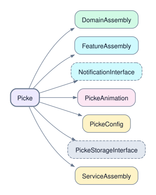

외부 패키지 선언: `googleMobileAds`, `kingfisher`.

</details>

### Feature · 11개

<details>
<summary>Ad</summary>

[모듈 선언](Projects/Feature/Ad/Project.swift)

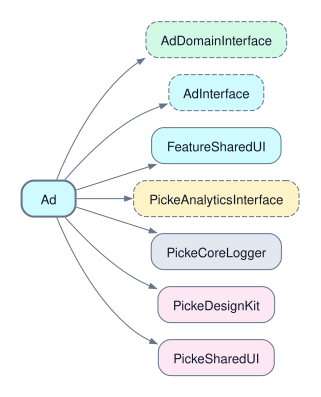

외부 패키지 선언: `adFit`, `composableArchitecture`, `googleMobileAds`.

</details>

<details>
<summary>Auth</summary>

[모듈 선언](Projects/Feature/Auth/Project.swift)

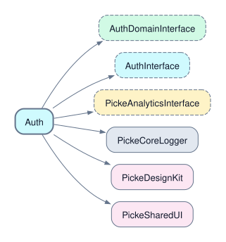

외부 패키지 선언: `composableArchitecture`.

</details>

<details>
<summary>Battle</summary>

[모듈 선언](Projects/Feature/Battle/Project.swift)

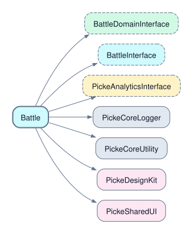

외부 패키지 선언: `composableArchitecture`.

</details>

<details>
<summary>Chat</summary>

[모듈 선언](Projects/Feature/Chat/Project.swift)

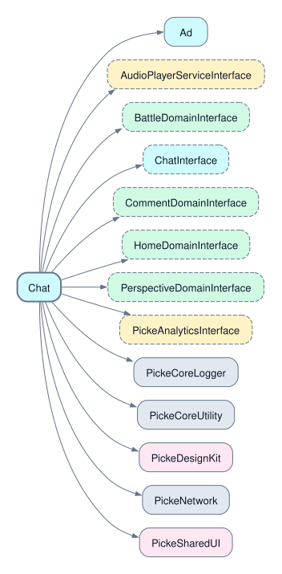

외부 패키지 선언: `composableArchitecture`, `tcaFlow`.

</details>

<details>
<summary>FeatureAssembly</summary>

[모듈 선언](Projects/Feature/FeatureAssembly/Project.swift)

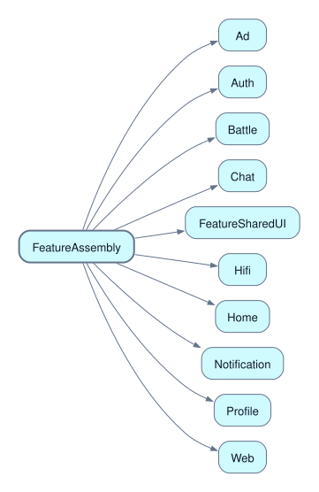

</details>

<details>
<summary>FeatureSharedUI</summary>

[모듈 선언](Projects/Feature/FeatureSharedUI/Project.swift)

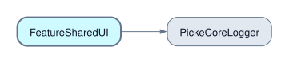

외부 패키지 선언: `adFit`.

</details>

<details>
<summary>Hifi</summary>

[모듈 선언](Projects/Feature/Hifi/Project.swift)

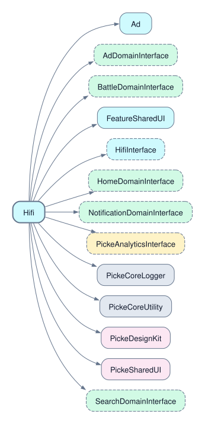

외부 패키지 선언: `composableArchitecture`, `kingfisher`.

</details>

<details>
<summary>Home</summary>

[모듈 선언](Projects/Feature/Home/Project.swift)

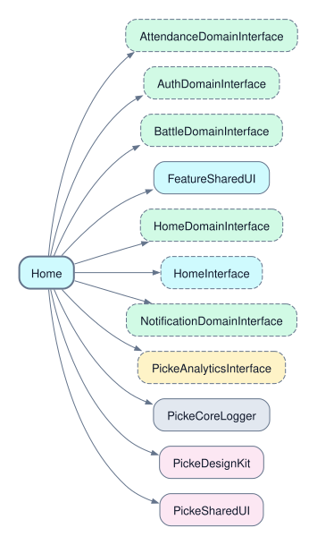

외부 패키지 선언: `composableArchitecture`, `kingfisher`, `tcaFlow`.

</details>

<details>
<summary>Notification</summary>

[모듈 선언](Projects/Feature/Notification/Project.swift)

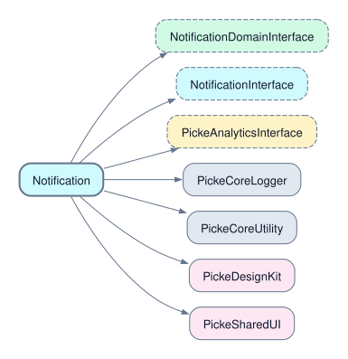

외부 패키지 선언: `composableArchitecture`.

</details>

<details>
<summary>Profile</summary>

[모듈 선언](Projects/Feature/Profile/Project.swift)

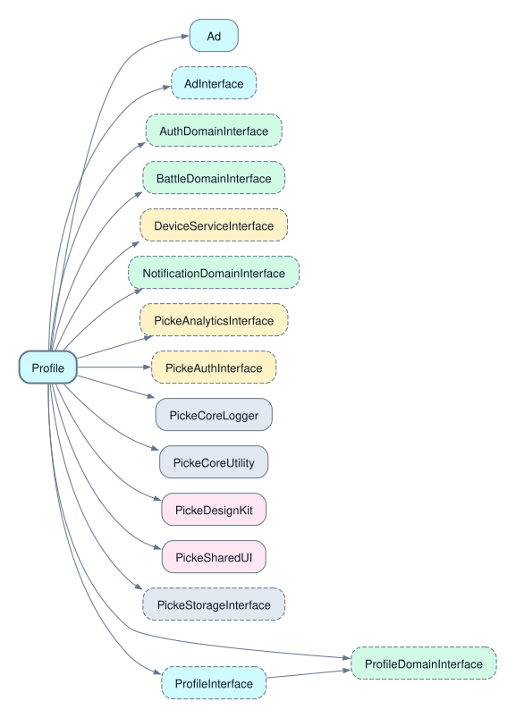

외부 패키지 선언: `composableArchitecture`, `kingfisher`, `tcaFlow`.

</details>

<details>
<summary>Web</summary>

[모듈 선언](Projects/Feature/Web/Project.swift)

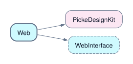

외부 패키지 선언: `composableArchitecture`.

</details>

### Domain · 12개

<details>
<summary>AdDomain</summary>

[모듈 선언](Projects/Domain/AdDomain/Project.swift)

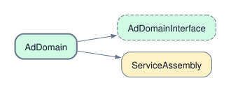

외부 패키지 선언: `composableArchitecture`.

</details>

<details>
<summary>AppUpdateDomain</summary>

[모듈 선언](Projects/Domain/AppUpdateDomain/Project.swift)

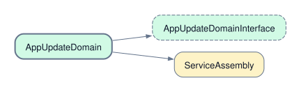

외부 패키지 선언: `composableArchitecture`.

</details>

<details>
<summary>AttendanceDomain</summary>

[모듈 선언](Projects/Domain/AttendanceDomain/Project.swift)

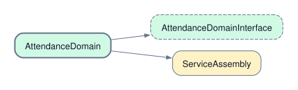

외부 패키지 선언: `composableArchitecture`.

</details>

<details>
<summary>AuthDomain</summary>

[모듈 선언](Projects/Domain/AuthDomain/Project.swift)

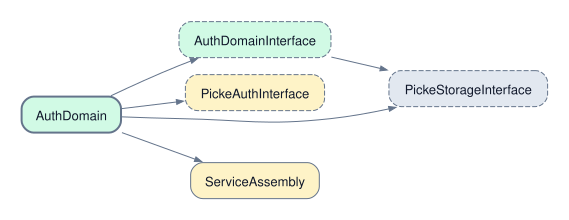

외부 패키지 선언: `composableArchitecture`, `googleSignIn`, `sharing`.

</details>

<details>
<summary>BattleDomain</summary>

[모듈 선언](Projects/Domain/BattleDomain/Project.swift)

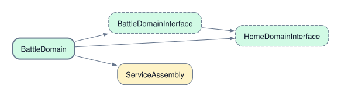

외부 패키지 선언: `composableArchitecture`.

</details>

<details>
<summary>CommentDomain</summary>

[모듈 선언](Projects/Domain/CommentDomain/Project.swift)

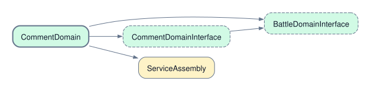

외부 패키지 선언: `composableArchitecture`.

</details>

<details>
<summary>DomainAssembly</summary>

[모듈 선언](Projects/Domain/DomainAssembly/Project.swift)

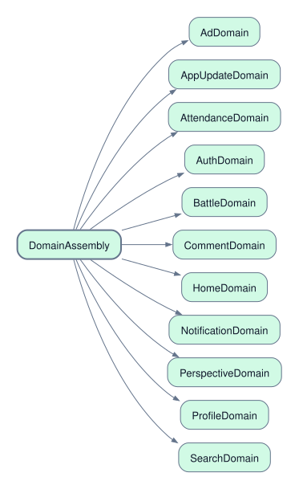

</details>

<details>
<summary>HomeDomain</summary>

[모듈 선언](Projects/Domain/HomeDomain/Project.swift)

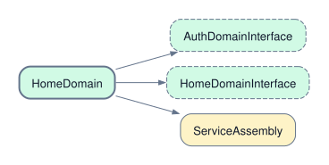

외부 패키지 선언: `composableArchitecture`.

</details>

<details>
<summary>NotificationDomain</summary>

[모듈 선언](Projects/Domain/NotificationDomain/Project.swift)


외부 패키지 선언: `composableArchitecture`.

</details>

<details>
<summary>PerspectiveDomain</summary>

[모듈 선언](Projects/Domain/PerspectiveDomain/Project.swift)

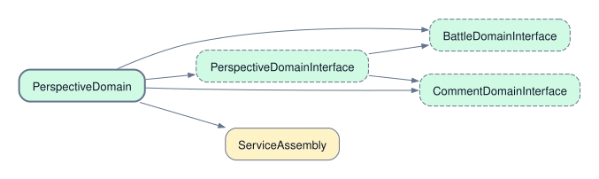

외부 패키지 선언: `composableArchitecture`.

</details>

<details>
<summary>ProfileDomain</summary>

[모듈 선언](Projects/Domain/ProfileDomain/Project.swift)

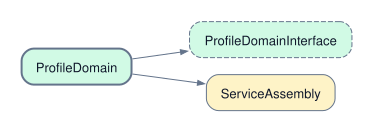

외부 패키지 선언: `composableArchitecture`.

</details>

<details>
<summary>SearchDomain</summary>

[모듈 선언](Projects/Domain/SearchDomain/Project.swift)

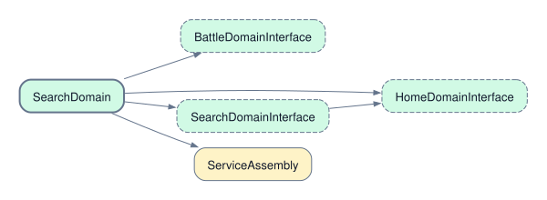

외부 패키지 선언: `composableArchitecture`.

</details>

### Service · 8개

<details>
<summary>API</summary>

[모듈 선언](Projects/Service/API/Project.swift)

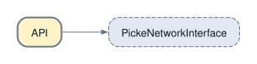

</details>

<details>
<summary>APIEndpoint</summary>

[모듈 선언](Projects/Service/APIEndpoint/Project.swift)

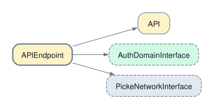

외부 패키지 선언: `alamofire`.

</details>

<details>
<summary>AudioPlayerService</summary>

[모듈 선언](Projects/Service/AudioPlayerService/Project.swift)

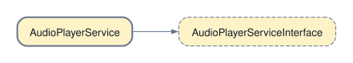

외부 패키지 선언: `composableArchitecture`.

</details>

<details>
<summary>DeviceService</summary>

[모듈 선언](Projects/Service/DeviceService/Project.swift)

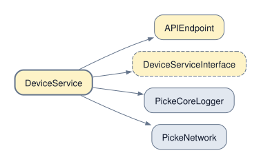

외부 패키지 선언: `composableArchitecture`.

</details>

<details>
<summary>PickeAnalytics</summary>

[모듈 선언](Projects/Service/PickeAnalytics/Project.swift)

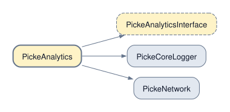

외부 패키지 선언: `composableArchitecture`, `mixpanel`, `mixpanelSessionReplay`, `sentry`, `sentrySwiftUI`.

</details>

<details>
<summary>PickeAuth</summary>

[모듈 선언](Projects/Service/PickeAuth/Project.swift)

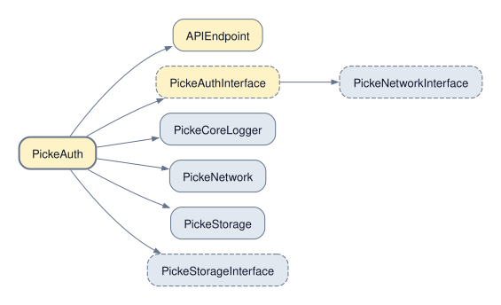

외부 패키지 선언: `composableArchitecture`.

</details>

<details>
<summary>PickeConfig</summary>

[모듈 선언](Projects/Service/PickeConfig/Project.swift)

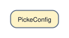

외부 패키지 선언: `firebaseCrashlytics`.

다른 내부 모듈에 대한 직접 의존성이 없습니다.

</details>

<details>
<summary>ServiceAssembly</summary>

[모듈 선언](Projects/Service/ServiceAssembly/Project.swift)

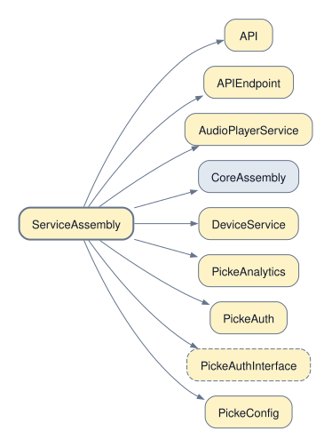

</details>

### Core · 7개

<details>
<summary>CoreAssembly</summary>

[모듈 선언](Projects/Core/CoreAssembly/Project.swift)

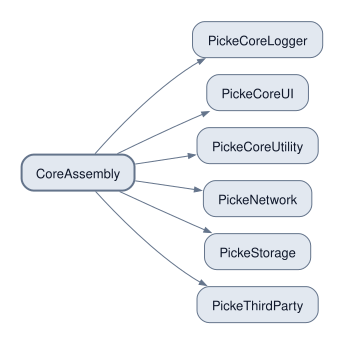

외부 패키지 선언: `composableArchitecture`.

</details>

<details>
<summary>PickeCoreLogger</summary>

[모듈 선언](Projects/Core/PickeCoreLogger/Project.swift)

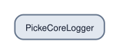

다른 내부 모듈에 대한 직접 의존성이 없습니다.

</details>

<details>
<summary>PickeCoreUI</summary>

[모듈 선언](Projects/Core/PickeCoreUI/Project.swift)

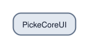

다른 내부 모듈에 대한 직접 의존성이 없습니다.

</details>

<details>
<summary>PickeCoreUtility</summary>

[모듈 선언](Projects/Core/PickeCoreUtility/Project.swift)

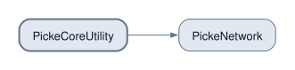

외부 패키지 선언: `dependencies`.

</details>

<details>
<summary>PickeNetwork</summary>

[모듈 선언](Projects/Core/PickeNetwork/Project.swift)

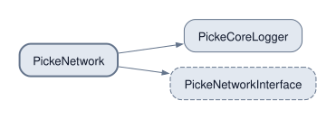

외부 패키지 선언: `alamofire`, `dependencies`.

</details>

<details>
<summary>PickeStorage</summary>

[모듈 선언](Projects/Core/PickeStorage/Project.swift)

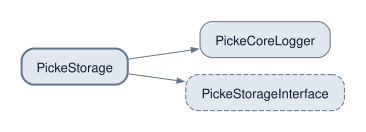

외부 패키지 선언: `composableArchitecture`, `sharing`, `sqliteData`.

</details>

<details>
<summary>PickeThirdParty</summary>

[모듈 선언](Projects/Core/PickeThirdParty/Project.swift)

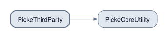

외부 패키지 선언: `composableArchitecture`, `sdwebImage`, `tcaFlow`.

</details>

### UI · 3개

<details>
<summary>PickeAnimation</summary>

[모듈 선언](Projects/UI/PickeAnimation/Project.swift)

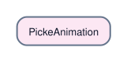

외부 패키지 선언: `sdwebImageCore`.

다른 내부 모듈에 대한 직접 의존성이 없습니다.

</details>

<details>
<summary>PickeDesignKit</summary>

[모듈 선언](Projects/UI/PickeDesignKit/Project.swift)

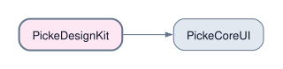

외부 패키지 선언: `composableArchitecture`.

</details>

<details>
<summary>PickeSharedUI</summary>

[모듈 선언](Projects/UI/PickeSharedUI/Project.swift)

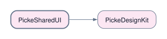

외부 패키지 선언: `composableArchitecture`, `kingfisher`.

</details>

갱신·검증:

```bash
python3 scripts/generate_module_diagrams.py
python3 scripts/generate_module_diagrams.py --check
```

SVG 생성에는 Graphviz의 `dot`이 필요합니다. 앱 빌드나 Tuist 캐시 생성은 실행하지 않습니다.

<!-- MODULE-DIAGRAMS:END -->

## 기술 스택

| 영역 | 기술 |
|---|---|
| 언어 | Swift 6, Swift Concurrency |
| UI | SwiftUI |
| 상태 관리 | The Composable Architecture 1.26.2 |
| 내비게이션 | TCAFlow 1.1.8 |
| 프로젝트 | Tuist 4.207.0, Mise |
| 의존성 주입 | Point-Free Dependencies |
| 네트워크 | PickeNetwork, Alamofire |
| 로컬 데이터 | SQLiteData |
| 인증 | Sign in with Apple, GoogleSignIn, AppAuth |
| 저장소 | PickeStorage, Keychain |
| 이미지 | SDWebImageSwiftUI, Kingfisher |
| 모니터링 | Firebase Crashlytics, Sentry |
| 분석·광고 | Mixpanel, Google Mobile Ads |
| 테스트 | Swift Testing, XCTest, Tuist |

의존성 버전의 실제 기준은 [Tuist/Package.swift](Tuist/Package.swift)와 [Tuist/Package.resolved](Tuist/Package.resolved)입니다. 보조 패키지 `swift-dependencies`는 Tuist에서 확인된 traits 조건부 의존성 누락 문제를 피하도록 `1.12.0`에 고정했습니다. 이 제한은 소스 빌드와 외부 모듈 캐시 모두에 적용됩니다.

지원 환경:

- iOS 17.0 이상
- Swift 6
- Xcode 26 이상
- iPhone

## 빌드 환경

로컬 확인 기준:

- Xcode 26.5
- Apple Swift 6.3.2
- Tuist 4.207.0

Ruby, Tuist, xcbeautify 버전은 [mise.toml](mise.toml)에 고정되어 있습니다.

~~~bash
mise install
mise exec -- tuist version
mise which ruby
mise exec -- xcbeautify --version
~~~

빌드 환경별 xcconfig에 필요한 값을 채웁니다.

~~~xcconfig
BASE_URL              = picke.store
GOOGLE_CLIENT_ID      = YOUR_GOOGLE_WEB_CLIENT_ID
GOOGLE_IOS_CLIENT_ID  = YOUR_GOOGLE_IOS_CLIENT_ID
REVERSED_CLIENT_ID    = YOUR_REVERSED_CLIENT_ID
KAKAO_REST_API_KEY    = YOUR_KAKAO_REST_API_KEY
REWARD_AD_UNIT        = YOUR_REWARD_AD_UNIT
~~~

OAuth redirect URI는 서버 중계 흐름을 기준으로 등록합니다.

| Provider | Redirect URI |
|---|---|
| Google | `https://picke.store/oauth/google` |
| Kakao | `https://picke.store/oauth/kakao` |
| Apple | Native Sign in with Apple |

## Tuist Dashboard와 캐시

Tuist Dashboard 프로젝트는 `picke2026/picke`입니다. 모듈 캐시 프로필, 저장소, Xcode 컴파일 캐시와 업로드 정책의 기준은 [Tuist.swift](Tuist.swift)입니다.

`TuistTool.swift`는 install 이후 Xcode Compilation Cache를 설정하고 외부 모듈 캐시를 준비합니다. CI에서는 두 캐시 준비 단계를 생략하고, `--no-binary-cache` 옵션은 외부 바이너리 캐시 준비만 생략합니다. `generate`는 별도 인증 명령이나 캐시 비활성화 옵션을 추가하지 않고 전달받은 인자로 실행합니다.

`./make`가 프로젝트 명령의 단일 진입점이며 `TuistTool.swift`를 실행합니다. 캐시 준비·사용·CI 제외·캐시 비활성화 옵션을 이 실행 경로에서 처리합니다. 소스를 수정하면 실행 파일을 다시 컴파일하지 않아도 다음 실행에 반영됩니다.

```bash
./make install --no-open   # 의존성 설치 → 로컬 외부 캐시 준비 → 프로젝트 생성
./make generate --no-open  # 준비된 캐시를 사용해 프로젝트 생성
./make cache               # 로컬 외부 바이너리 캐시 준비
./make cache:setup         # Xcode Compilation Cache 설정
./make setup               # mise 설치 → install → cache warm → generate
```

`generate`는 캐시를 새로 빌드하지 않습니다. 첫 실행이나 의존성 변경 후에는 `install` 또는 `cache`로 준비합니다. 캐시 적중은 Xcode 버전, 구성과 의존성 해시가 일치해야 합니다.

```bash
./make install --no-binary-cache --no-open  # 캐시 준비와 사용 모두 생략
./make generate --no-binary-cache --no-open
./make test --no-binary-cache
```

`./make cache`는 `tuist cache warm --external-only`를 실행합니다. `TUIST_LOCAL_CACHE_ONLY=true` 환경변수를 함께 전달하며, 실제 저장소·연결 정책은 `Tuist.swift`가 결정합니다. 캐시 준비가 실패하면 오류를 반환하고 generate로 넘어가지 않습니다. `./make cache:setup`은 Attendance와 동일하게 `tuist setup cache`를 실행하는 별도 명령이며, `Tuist.swift`의 컴파일 캐시 설정과 함께 사용합니다.

명령 순서와 CI/opt-out 동작은 `python3 scripts/tests/test_tuist_cache_commands.py`로 검사합니다. 이 검사는 실제 패키지 설치나 캐시 빌드를 실행하지 않습니다.

## 빠른 시작

~~~bash
git clone git@github.com:SWYP-Find/Picke-iOS.git
cd Picke-iOS

./make setup
open Picke.xcworkspace
~~~

Xcode에서 `Picke-Stage` 또는 필요한 스킴과 사용할 iPhone 시뮬레이터를 선택해 실행합니다.

`CLAUDE.md`가 필요한 도구는 `AGENTS.md`와 같은 내용을 보도록 심볼릭 링크를 만들 수 있습니다.

~~~bash
ln -s AGENTS.md CLAUDE.md
~~~

## 개발 명령어

~~~bash
./make setup                     # mise 설치, install, 로컬 외부 캐시 준비, generate
./make generate                  # Demo 앱을 포함해 Xcode 프로젝트 생성
./make generate --no-open        # Xcode를 열지 않고 프로젝트 생성
./make generate --no-binary-cache --no-open
./make build                     # clean, install, generate
./make install                   # 의존성 설치, 로컬 외부 캐시 준비 후 generate
./make test                      # 전체 테스트
./make test --no-binary-cache    # 로컬 바이너리 캐시 없이 전체 테스트
./make cache                     # 외부 바이너리 캐시 준비
./make cache:setup               # Xcode Compilation Cache 설정
./make format                    # SwiftFormat 적용
./make lint                      # SwiftFormat 검사
./make clean                     # 생성 프로젝트 정리
./make reset                     # DerivedData 정리 후 프로젝트 재생성
~~~

`Makefile`은 사용하지 않습니다. 테스트는 `./make test` 또는 `mise exec -- tuist test`로 실행합니다.

새 모듈 생성:

~~~bash
./make feature <이름>
./make core <이름>
./make service <이름>
./make domain <이름>
./make ui <이름>
./make module <레이어> <이름>

# 자동으로 만든 카탈로그 case가 원하는 이름과 다를 때
./make feature <이름> --case <케이스명>
~~~

모듈 생성 명령은 scaffold뿐 아니라 모듈 카탈로그와 해당 레이어 Assembly 의존성도 함께 갱신합니다.

## 배포와 자동화

- Fastlane QA와 release 레인은 빌드 번호를 갱신한 뒤 `tuist generate --no-binary-cache --no-open`로 워크스페이스를 재생성합니다.
- workspace가 없을 때 fallback 경로는 `mise exec -- tuist install` 후 `./make generate --no-binary-cache --no-open`을 실행합니다.
- Fastlane QA/release 배포가 성공하면 같은 IPA를 Tuist Preview의 `qa`/`release` 트랙에 공유합니다. Preview 업로드에는 Tuist 로그인이 필요합니다.
- 이 IPA는 App Store Connect용으로 서명되어 Preview 링크에서 기기에 직접 설치할 수 없습니다. 기기 테스트는 TestFlight를 사용합니다.
- Tuist Preview 업로드가 실패해도 이미 완료된 TestFlight/App Store 배포는 유지되며, Fastlane 로그에 경고가 남습니다.

## 개발 가이드

- [TCA 패턴](docs/agent/tca-patterns.md)
- [SwiftUI 패턴](docs/agent/swiftui-patterns.md)
- [TCAFlow 네비게이션](docs/agent/tcaflow-navigation.md)
- [DI 가이드](docs/agent/dependency-injection.md)
- [Micro Feature 진행 현황](docs/agent/micro-feature-migration-progress.md)
- [도메인/데이터/피처 아키텍처](docs/domain-data-feature-architecture.md)

## 브랜치 전략

- `main`: 프로덕션 배포
- `develop`: 개발 통합
- `feature/*`: 기능 작업
- `fix/*`: 버그 수정

작업 브랜치에서 검증 후 `develop`으로 Pull Request를 올립니다.

## 문의

- Issues: [github.com/SWYP-Find/Picke-iOS/issues](https://github.com/SWYP-Find/Picke-iOS/issues)
- Discussions: [github.com/SWYP-Find/Picke-iOS/discussions](https://github.com/SWYP-Find/Picke-iOS/discussions)
