# Picke iOS

<div align="center">

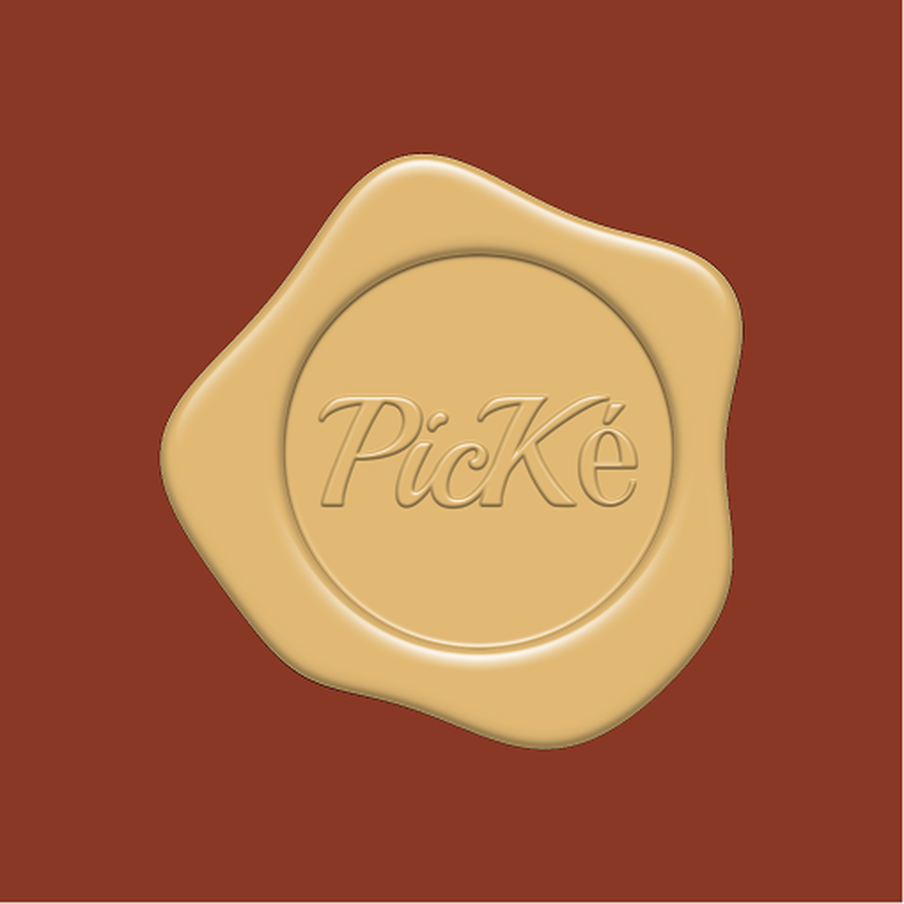

**가치관 충돌에서 시작하는 참여형 철학 배틀 플랫폼**


[앱 스토어](https://apps.apple.com/kr/app/id6776677382) · [아키텍처](#아키텍처) · [빠른 시작](#빠른-시작) · [개발 명령어](#개발-명령어)

</div>

## 프로젝트

Picke는 일상의 질문을 철학 배틀로 풀어내는 iOS 앱입니다. 서로 다른 관점의 토론을 듣고, 투표와 의견으로 자신의 생각을 표현하며, 배틀 전후의 변화와 나의 철학자 유형을 확인할 수 있습니다.

주요 기능:

- Apple·Google·Kakao 소셜 로그인
- 오늘의 배틀, 토론 콘텐츠와 오디오 재생, 사전·사후 투표
- 홈 피드, 탐색, 검색, 큐레이팅 추천
- 관점 등록, 대댓글, 좋아요, 신고
- 철학자 유형, 리캡 공유, 포인트와 배틀 기록
- 푸시 알림, 딥링크, 알림 설정

## 스크린샷

<div align="center">

| 홈 | 철학 배틀 | 관점과 댓글 |
|:---:|:---:|:---:|
| 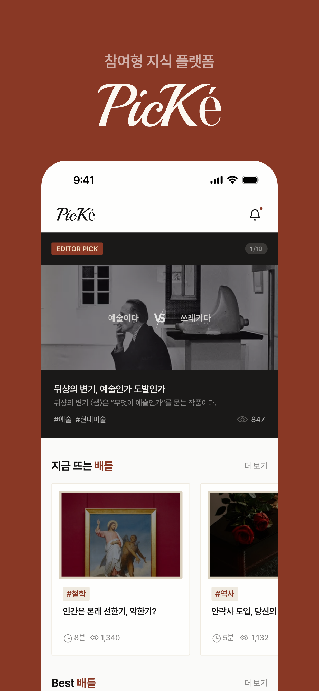 | 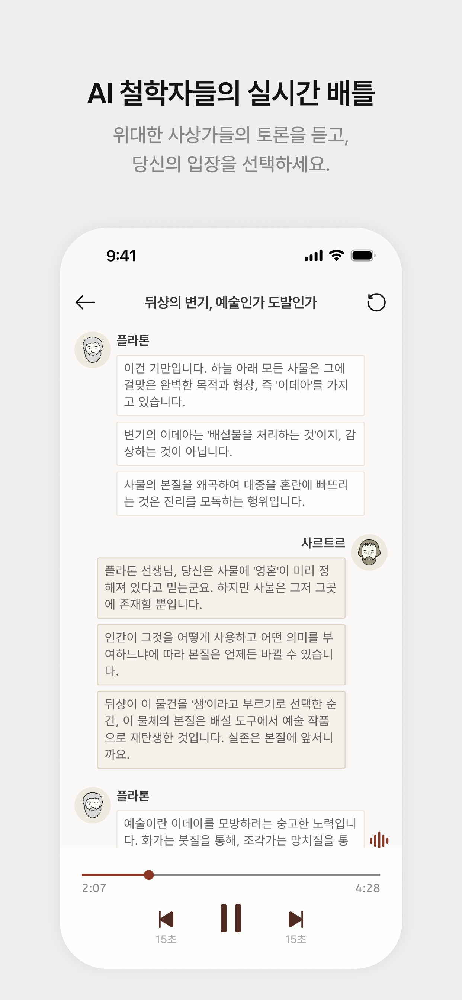 | 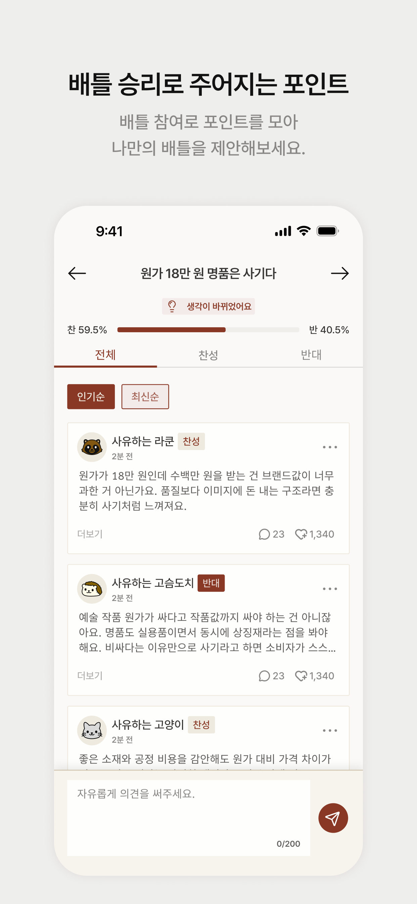 |

| 오늘의 투표 | 나의 철학자 유형 |
|:---:|:---:|
| 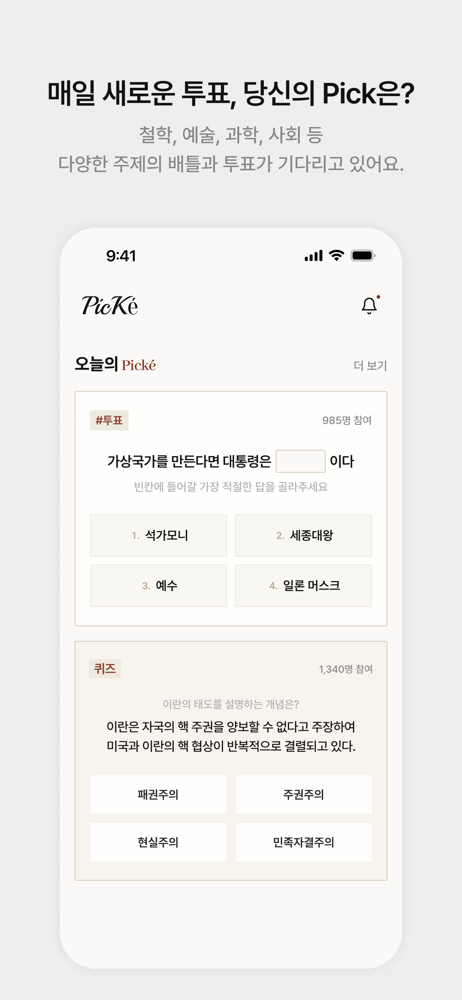 | 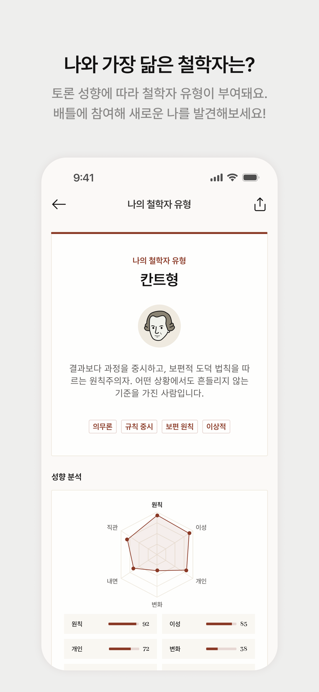 |

</div>

## 아키텍처

SwiftUI와 The Composable Architecture를 기반으로 한 Clean Architecture 멀티 모듈 프로젝트입니다. Tuist가 프로젝트 생성, 모듈 의존성, 테스트 스킴, 바이너리 캐시 흐름을 관리합니다.

~~~text
Projects/
├── App/                         # 앱 진입점, 스플래시, AppReducer, DI 조립, 리소스
├── Feature/
│   ├── FeatureAssembly/         # 전체 Feature 조립 결과를 앱에 제공
│   ├── FeatureSharedUI/         # Feature 공통 UI
│   ├── Ad/                      # Kakao·서버 광고 표시
│   ├── Auth/                    # 로그인
│   ├── Home/                    # 홈·출석 모달
│   ├── Battle/                  # 배틀 메인
│   ├── Chat/                    # 채팅·투표·관점·큐레이팅
│   ├── Hifi/                    # 탐색·검색
│   ├── Notification/            # 알림
│   ├── Profile/                 # 마이페이지·설정·리캡
│   └── Web/                     # WebView
├── Domain/
│   ├── DomainAssembly/          # 도메인별 라이브 의존성 조립
│   ├── AdDomain/                # 광고 모델·조회·노출 집계 (Repository/UseCase)
│   ├── AuthDomain/              # 인증 도메인
│   ├── BattleDomain/            # 배틀 도메인
│   ├── CommentDomain/           # 댓글·대댓글 도메인
│   ├── HomeDomain/              # 홈 도메인
│   ├── NotificationDomain/      # 알림 도메인
│   ├── PerspectiveDomain/       # 관점 도메인
│   ├── ProfileDomain/           # 프로필 도메인
│   ├── SearchDomain/            # 검색 도메인
│   ├── AttendanceDomain/        # 출석 도메인
│   └── AppUpdateDomain/         # 앱 업데이트 도메인
├── Service/
│   ├── ServiceAssembly/         # API·인증·분석·디바이스 서비스 조립
│   ├── API/                     # API 경로 상수
│   ├── APIEndpoint/             # 요청 명세
│   ├── PickeAuth/               # 인증 세션과 토큰 갱신
│   ├── PickeAnalytics/          # 분석 이벤트
│   ├── PickeConfig/             # 앱 환경 설정
│   ├── DeviceService/           # 디바이스·푸시 토큰
│   └── AudioPlayerService/      # 오디오 재생
├── Core/
│   ├── CoreAssembly/            # Core 구현 묶음
│   ├── PickeNetwork/            # Alamofire 기반 네트워크
│   ├── PickeStorage/            # Keychain 저장소
│   ├── PickeCoreLogger/         # 로깅
│   ├── PickeCoreUtility/        # 공통 Swift·TCA 유틸리티
│   ├── PickeCoreUI/             # UI 기반 타입
│   └── PickeThirdParty/         # 외부 패키지 재노출
└── UI/
    ├── PickeDesignKit/          # 디자인 토큰·컴포넌트·리소스
    ├── PickeSharedUI/           # 앱 공통 화면 컴포넌트
    └── PickeAnimation/          # 이미지·애니메이션 리소스
~~~

### 의존성 흐름

~~~mermaid
flowchart TD
    App --> FeatureAssembly
    App --> DomainAssembly
    App --> ServiceAssembly

    FeatureAssembly --> Features[Feature modules]
    Features --> DomainInterfaces["*DomainInterface"]
    Features --> UI[UI modules]

    DomainAssembly --> Domains[Domain modules]
    Domains --> DomainInterfaces
    Domains --> ServiceAssembly

    ServiceAssembly --> Services[Service modules]
    ServiceAssembly --> CoreAssembly
    Services --> CoreAssembly

    CoreAssembly --> Network[PickeNetwork]
    CoreAssembly --> Storage[PickeStorage]
    CoreAssembly --> Logger[PickeCoreLogger]
~~~

설계 원칙:

- App은 FeatureAssembly, DomainAssembly, ServiceAssembly를 통해 앱 전체 의존성을 조립합니다.
- Feature 모듈은 화면, TCA Reducer, Coordinator를 소유하고 외부 IO는 Domain Interface와 UseCase를 통해 호출합니다.
- Domain 모듈은 기능별 Entity, Repository 계약, UseCase 구현을 소유합니다.
- ServiceAssembly는 API, 인증, 분석, 디바이스, 오디오 서비스를 CoreAssembly와 연결합니다.
- CoreAssembly는 Network, Storage, Logger, Utility 등 앱 기반 구현을 묶습니다.
- UI 계층은 디자인 토큰, 공통 컴포넌트, 애니메이션 리소스를 제공합니다.

### 의존성 주입

별도 런타임 DI 컨테이너 대신 Point-Free Dependencies를 사용합니다.

- 각 Domain·Service·Core 모듈은 필요한 `DependencyKey`와 기본값을 선언합니다.
- Assembly 모듈은 live 구현을 `DependencyValues`에 등록합니다.
- Feature는 Repository 구현체를 직접 알지 않고 UseCase 또는 Interface만 사용합니다.
- 테스트·프리뷰 기본값은 Interface 또는 Testing 타깃에서 관리합니다.

### 모듈 그래프 생성

~~~bash
./make graph       # 외부 패키지·Demo 제외, Tests·Testing·Interface 포함
./make graph:prod  # 외부 패키지·Demo·테스트 타깃 제외
~~~

Graphviz가 필요하며, 실행 결과는 저장소 루트의 `graph.png`로 생성됩니다.

<details>
<summary>전체 42개 모듈의 상세 의존성 그래프</summary>

<!-- MODULE-DIAGRAMS:START -->
## 모듈 그래프

현재 42개 모듈의 구현·Interface 타깃 의존성을 표시합니다. 각 항목을 펼치면 GitHub에서 SVG 그림을 바로 볼 수 있습니다.

화살표는 **참조하는 타깃 → 참조되는 타깃**, 점선 테두리는 **Interface**입니다. `Project.swift`의 `dependencies`·`interfaceDependencies`와 템플릿이 연결하는 자기 Interface를 반영합니다. 외부 SPM 패키지는 이름으로 별도 표기하고, Tests·Testing·Demo와 전이 의존성은 생략합니다.

`APIEndpoint → AuthDomainInterface`처럼 현재 코드에 존재하는 계층 간 참조도 그대로 표시합니다. 실행 순서나 이상적인 아키텍처를 나타내는 그림은 아닙니다.

[광고 HTML](docs/diagrams/picke-ads.html) · [전체 도메인 HTML](docs/diagrams/picke-domains.html) — 파일을 내려받아 브라우저에서 열면 확대·검색할 수 있습니다.

### App · 1개

<details>
<summary>Picke</summary>

[모듈 선언](Projects/App/Project.swift)

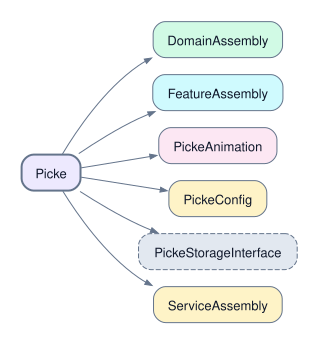

외부 패키지 선언: `googleMobileAds`, `kingfisher`.

</details>

### Feature · 11개

<details>
<summary>Ad</summary>

[모듈 선언](Projects/Feature/Ad/Project.swift)

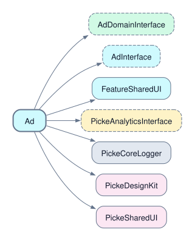

외부 패키지 선언: `adFit`, `composableArchitecture`, `googleMobileAds`.

</details>

<details>
<summary>Auth</summary>

[모듈 선언](Projects/Feature/Auth/Project.swift)

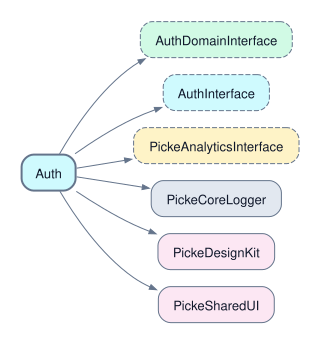

외부 패키지 선언: `composableArchitecture`.

</details>

<details>
<summary>Battle</summary>

[모듈 선언](Projects/Feature/Battle/Project.swift)

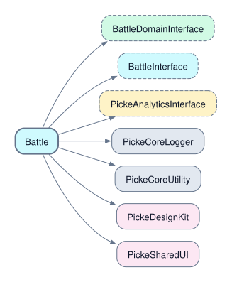

외부 패키지 선언: `composableArchitecture`.

</details>

<details>
<summary>Chat</summary>

[모듈 선언](Projects/Feature/Chat/Project.swift)

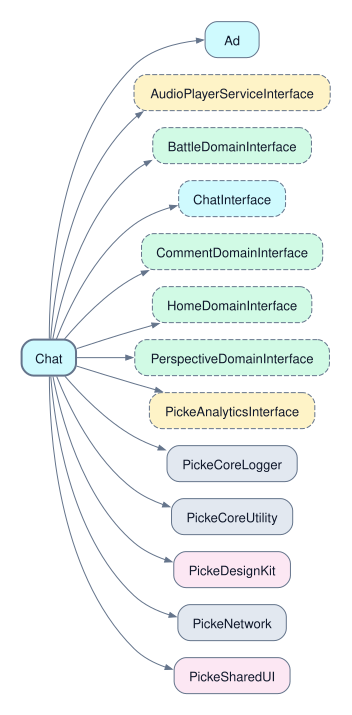

외부 패키지 선언: `composableArchitecture`, `tcaFlow`.

</details>

<details>
<summary>FeatureAssembly</summary>

[모듈 선언](Projects/Feature/FeatureAssembly/Project.swift)

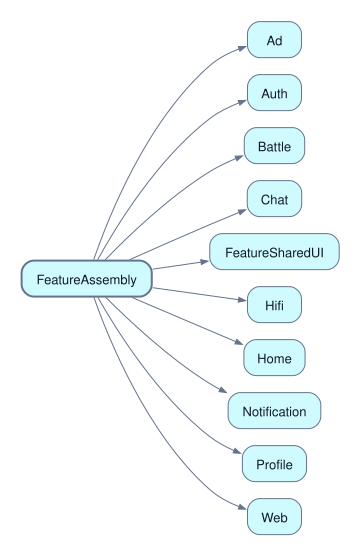

</details>

<details>
<summary>FeatureSharedUI</summary>

[모듈 선언](Projects/Feature/FeatureSharedUI/Project.swift)

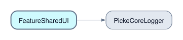

외부 패키지 선언: `adFit`.

</details>

<details>
<summary>Hifi</summary>

[모듈 선언](Projects/Feature/Hifi/Project.swift)

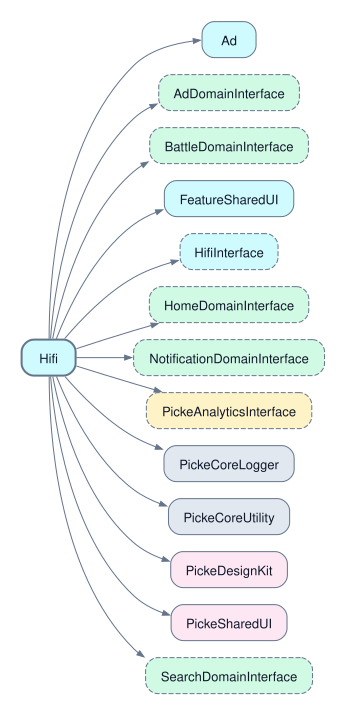

외부 패키지 선언: `composableArchitecture`, `kingfisher`.

</details>

<details>
<summary>Home</summary>

[모듈 선언](Projects/Feature/Home/Project.swift)

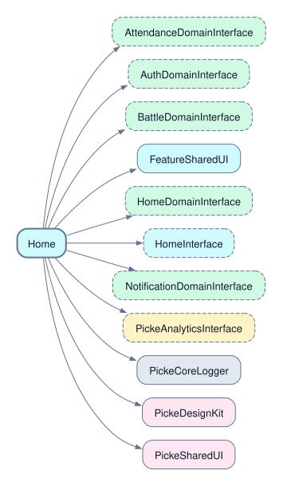

외부 패키지 선언: `composableArchitecture`, `kingfisher`, `tcaFlow`.

</details>

<details>
<summary>Notification</summary>

[모듈 선언](Projects/Feature/Notification/Project.swift)

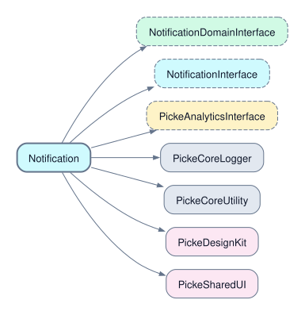

외부 패키지 선언: `composableArchitecture`.

</details>

<details>
<summary>Profile</summary>

[모듈 선언](Projects/Feature/Profile/Project.swift)

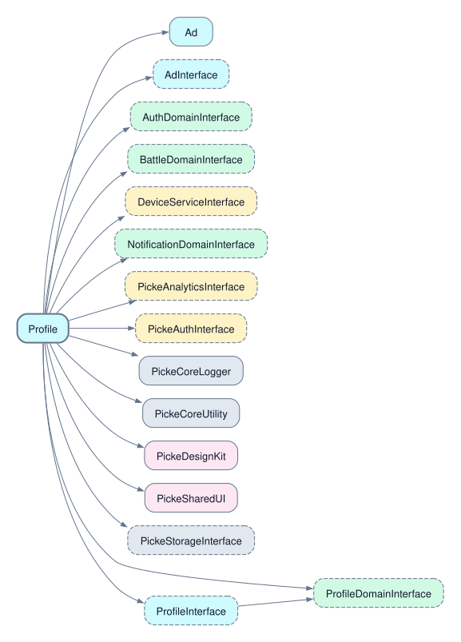

외부 패키지 선언: `composableArchitecture`, `kingfisher`, `tcaFlow`.

</details>

<details>
<summary>Web</summary>

[모듈 선언](Projects/Feature/Web/Project.swift)

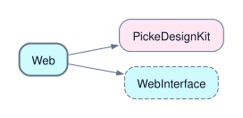

외부 패키지 선언: `composableArchitecture`.

</details>

### Domain · 12개

<details>
<summary>AdDomain</summary>

[모듈 선언](Projects/Domain/AdDomain/Project.swift)

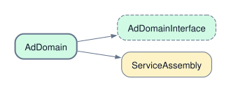

외부 패키지 선언: `composableArchitecture`.

</details>

<details>
<summary>AppUpdateDomain</summary>

[모듈 선언](Projects/Domain/AppUpdateDomain/Project.swift)

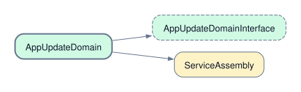

외부 패키지 선언: `composableArchitecture`.

</details>

<details>
<summary>AttendanceDomain</summary>

[모듈 선언](Projects/Domain/AttendanceDomain/Project.swift)

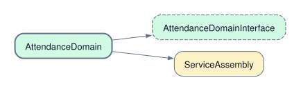

외부 패키지 선언: `composableArchitecture`.

</details>

<details>
<summary>AuthDomain</summary>

[모듈 선언](Projects/Domain/AuthDomain/Project.swift)

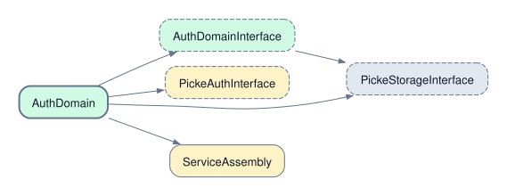

외부 패키지 선언: `composableArchitecture`, `googleSignIn`, `sharing`.

</details>

<details>
<summary>BattleDomain</summary>

[모듈 선언](Projects/Domain/BattleDomain/Project.swift)

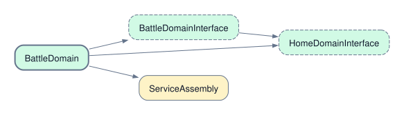

외부 패키지 선언: `composableArchitecture`.

</details>

<details>
<summary>CommentDomain</summary>

[모듈 선언](Projects/Domain/CommentDomain/Project.swift)

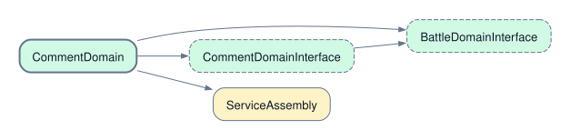

외부 패키지 선언: `composableArchitecture`.

</details>

<details>
<summary>DomainAssembly</summary>

[모듈 선언](Projects/Domain/DomainAssembly/Project.swift)

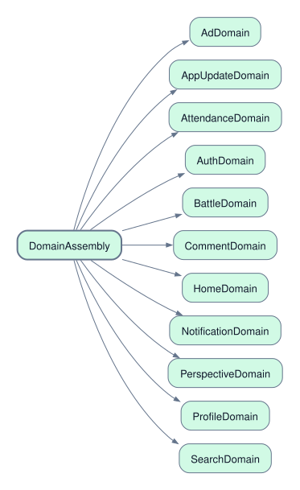

</details>

<details>
<summary>HomeDomain</summary>

[모듈 선언](Projects/Domain/HomeDomain/Project.swift)

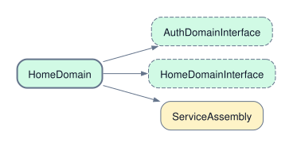

외부 패키지 선언: `composableArchitecture`.

</details>

<details>
<summary>NotificationDomain</summary>

[모듈 선언](Projects/Domain/NotificationDomain/Project.swift)


외부 패키지 선언: `composableArchitecture`.

</details>

<details>
<summary>PerspectiveDomain</summary>

[모듈 선언](Projects/Domain/PerspectiveDomain/Project.swift)

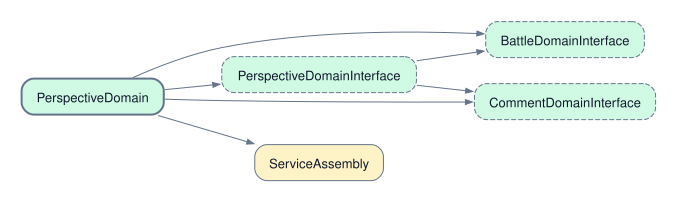

외부 패키지 선언: `composableArchitecture`.

</details>

<details>
<summary>ProfileDomain</summary>

[모듈 선언](Projects/Domain/ProfileDomain/Project.swift)

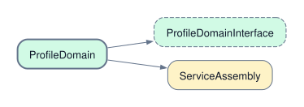

외부 패키지 선언: `composableArchitecture`.

</details>

<details>
<summary>SearchDomain</summary>

[모듈 선언](Projects/Domain/SearchDomain/Project.swift)

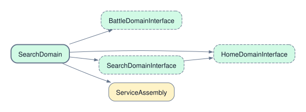

외부 패키지 선언: `composableArchitecture`.

</details>

### Service · 8개

<details>
<summary>API</summary>

[모듈 선언](Projects/Service/API/Project.swift)

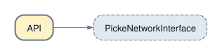

</details>

<details>
<summary>APIEndpoint</summary>

[모듈 선언](Projects/Service/APIEndpoint/Project.swift)

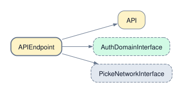

외부 패키지 선언: `alamofire`.

</details>

<details>
<summary>AudioPlayerService</summary>

[모듈 선언](Projects/Service/AudioPlayerService/Project.swift)

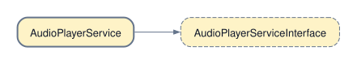

외부 패키지 선언: `composableArchitecture`.

</details>

<details>
<summary>DeviceService</summary>

[모듈 선언](Projects/Service/DeviceService/Project.swift)

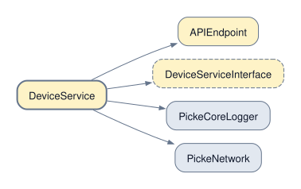

외부 패키지 선언: `composableArchitecture`.

</details>

<details>
<summary>PickeAnalytics</summary>

[모듈 선언](Projects/Service/PickeAnalytics/Project.swift)

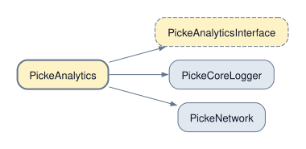

외부 패키지 선언: `composableArchitecture`, `mixpanel`, `mixpanelSessionReplay`, `sentry`, `sentrySwiftUI`.

</details>

<details>
<summary>PickeAuth</summary>

[모듈 선언](Projects/Service/PickeAuth/Project.swift)

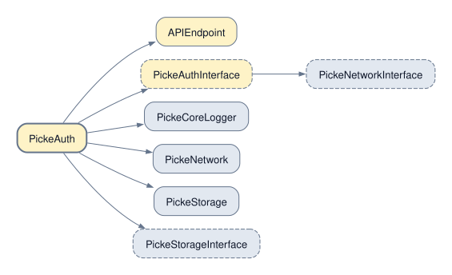

외부 패키지 선언: `composableArchitecture`.

</details>

<details>
<summary>PickeConfig</summary>

[모듈 선언](Projects/Service/PickeConfig/Project.swift)

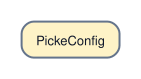

외부 패키지 선언: `firebaseCrashlytics`.

다른 내부 모듈에 대한 직접 의존성이 없습니다.

</details>

<details>
<summary>ServiceAssembly</summary>

[모듈 선언](Projects/Service/ServiceAssembly/Project.swift)

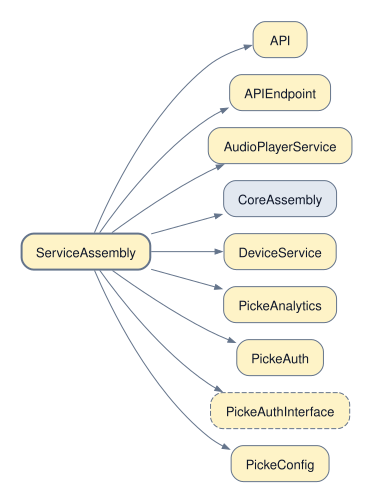

</details>

### Core · 7개

<details>
<summary>CoreAssembly</summary>

[모듈 선언](Projects/Core/CoreAssembly/Project.swift)

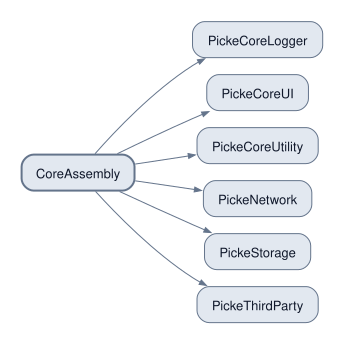

외부 패키지 선언: `composableArchitecture`.

</details>

<details>
<summary>PickeCoreLogger</summary>

[모듈 선언](Projects/Core/PickeCoreLogger/Project.swift)

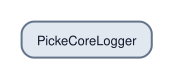

다른 내부 모듈에 대한 직접 의존성이 없습니다.

</details>

<details>
<summary>PickeCoreUI</summary>

[모듈 선언](Projects/Core/PickeCoreUI/Project.swift)

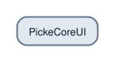

다른 내부 모듈에 대한 직접 의존성이 없습니다.

</details>

<details>
<summary>PickeCoreUtility</summary>

[모듈 선언](Projects/Core/PickeCoreUtility/Project.swift)

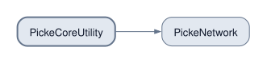

외부 패키지 선언: `dependencies`.

</details>

<details>
<summary>PickeNetwork</summary>

[모듈 선언](Projects/Core/PickeNetwork/Project.swift)

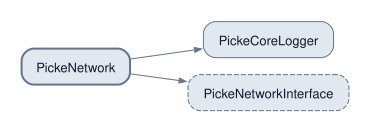

외부 패키지 선언: `alamofire`, `dependencies`.

</details>

<details>
<summary>PickeStorage</summary>

[모듈 선언](Projects/Core/PickeStorage/Project.swift)

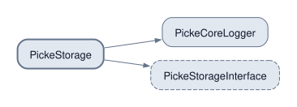

외부 패키지 선언: `composableArchitecture`, `sharing`, `sqliteData`.

</details>

<details>
<summary>PickeThirdParty</summary>

[모듈 선언](Projects/Core/PickeThirdParty/Project.swift)

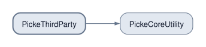

외부 패키지 선언: `composableArchitecture`, `sdwebImage`, `tcaFlow`.

</details>

### UI · 3개

<details>
<summary>PickeAnimation</summary>

[모듈 선언](Projects/UI/PickeAnimation/Project.swift)

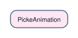

외부 패키지 선언: `sdwebImageCore`.

다른 내부 모듈에 대한 직접 의존성이 없습니다.

</details>

<details>
<summary>PickeDesignKit</summary>

[모듈 선언](Projects/UI/PickeDesignKit/Project.swift)

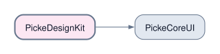

외부 패키지 선언: `composableArchitecture`.

</details>

<details>
<summary>PickeSharedUI</summary>

[모듈 선언](Projects/UI/PickeSharedUI/Project.swift)

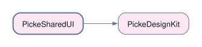

외부 패키지 선언: `composableArchitecture`, `kingfisher`.

</details>

갱신·검증:

```bash
python3 scripts/generate_module_diagrams.py
python3 scripts/generate_module_diagrams.py --check
```

SVG 생성에는 Graphviz의 `dot`이 필요합니다. 앱 빌드나 Tuist 캐시 생성은 실행하지 않습니다.

<!-- MODULE-DIAGRAMS:END -->

</details>

## 기술 스택

| 영역 | 기술 |
|---|---|
| 언어 | Swift 6, Swift Concurrency |
| UI | SwiftUI |
| 상태 관리 | The Composable Architecture 1.26.2 |
| 내비게이션 | TCAFlow main |
| 프로젝트 | Tuist 4.207.0, Mise |
| 의존성 주입 | Point-Free Dependencies |
| 네트워크 | PickeNetwork, Alamofire |
| 인증 | Sign in with Apple, GoogleSignIn, AppAuth, Kakao OAuth |
| 저장소 | PickeStorage, Keychain, SQLiteData |
| 이미지 | SDWebImageSwiftUI, Kingfisher |
| 모니터링 | Firebase Crashlytics, Sentry |
| 분석·광고 | Mixpanel, Sentry, Google Mobile Ads, Kakao AdFit |
| 테스트 | Swift Testing, XCTest, Tuist |

패키지 선언과 실제 해석된 버전은 [Tuist/Package.swift](Tuist/Package.swift)와 [Tuist/Package.resolved](Tuist/Package.resolved)를 기준으로 합니다.

## 빌드 환경

| 구성 | 용도 | 스킴 |
|---|---|---|
| Stage | 로컬 개발·디버깅 | Picke-Stage |
| Prod | 배포·아카이브 | Picke-Prod |
| Release | 기본 최적화 빌드 | Picke |

iOS 17.0 이상과 iPhone을 지원합니다. Swift 도구 버전 6.2 이상을 지원하는 Xcode가 필요하며, Ruby·Tuist·xcbeautify 버전은 [mise.toml](mise.toml)에 고정되어 있습니다.

환경 설정은 `Config/Stage.xcconfig`와 `Config/Prod.xcconfig`에서 관리합니다. API 주소, OAuth 클라이언트 ID, 광고 설정과 `GoogleService-Info.plist` 등 저장소에 포함되지 않은 파일은 팀의 안전한 공유 경로에서 준비합니다.

## 빠른 시작

### 요구사항

- Swift 6.2 이상을 지원하는 Xcode
- Homebrew와 Mise
- 프로젝트 환경 설정 파일과 GoogleService-Info.plist

### 설치

~~~bash
git clone https://github.com/SWYP-Find/Picke-iOS.git
cd Picke-iOS

# Mise 도구 설치 → 의존성·캐시 준비 → 워크스페이스 생성
./make setup

open Picke.xcworkspace
~~~

Xcode에서 **Picke-Stage** 스킴과 사용할 iPhone 시뮬레이터를 선택해 실행합니다.

## 개발 명령어

~~~bash
./make setup                     # 도구 설치, 의존성·캐시 준비, 프로젝트 생성
./make generate                  # Demo 앱을 포함해 Xcode 프로젝트 생성
./make generate --no-open        # Xcode를 열지 않고 프로젝트 생성
./make build                     # clean → install → 캐시 준비 → generate
./make install                   # 의존성 설치, 캐시 준비 후 generate
./make test                      # 전체 테스트
./make cache                     # 외부 바이너리 캐시 준비
./make cache:setup               # Xcode Compilation Cache 설정
./make format                    # SwiftFormat 적용
./make lint                      # SwiftFormat 검사
./make clean                     # 생성 프로젝트 정리
./make reset                     # 앱 DerivedData 정리 후 프로젝트 재생성
~~~

새 모듈 생성:

~~~bash
./make feature <이름>
./make core <이름>
./make service <이름>
./make domain <이름>
./make ui <이름>

# 카탈로그 케이스 이름을 직접 지정할 때
./make feature <이름> --case <케이스명>
~~~

모듈 생성 명령은 scaffold와 모듈 카탈로그, 해당 레이어 Assembly 의존성을 함께 갱신합니다.

### 캐시

[Tuist Dashboard](https://tuist.dev/picke2026/picke) 연결과 캐시 정책은 [Tuist.swift](Tuist.swift), 명령 실행 흐름은 [TuistTool.swift](TuistTool.swift)에서 관리합니다.

- `setup`과 `install`은 Xcode Compilation Cache와 로컬 외부 바이너리 캐시를 준비합니다.
- `generate`는 준비된 캐시를 사용하며 새로 빌드하지 않습니다.
- CI에서는 `./make`의 캐시 준비 단계를 생략합니다.
- `picke-external` 프로필은 IssueReporting과 IssueReportingTestSupport를 캐시에서 제외하고 소스로 빌드합니다.

캐시 없이 확인하려면:

~~~bash
./make install --no-binary-cache --no-open
./make generate --no-binary-cache --no-open
./make test --no-binary-cache
~~~

## 테스트와 CI

- `./make test`로 Tuist 테스트를 실행합니다.
- Workspace의 자동 생성 스킴은 관련 타깃을 기준으로 코드 커버리지를 수집합니다.
- Pull Request에는 Codex·Gemini 코드 리뷰 워크플로가 구성되어 있습니다.
- `v*` 태그를 푸시하면 해당 커밋을 `release` 브랜치에 병합하고 GitHub Release를 생성하거나 최신 릴리스로 표시합니다.

관련 워크플로:

- [Codex PR 리뷰](.github/workflows/codex-pr-review.yml)
- [Gemini 코드 리뷰](.github/workflows/gemini-code-review.yml)
- [릴리스 브랜치·GitHub Release 동기화](.github/workflows/release-sync.yml)

## 배포

[Fastlane](fastlane/README.md)으로 TestFlight 업로드와 App Store 심사 제출을 진행합니다.

| 레인 | 용도 |
|---|---|
| QA | TestFlight 빌드·업로드 |
| release | App Store 배포 |
| submit_for_review | 이미 업로드한 버전의 심사 제출 |

QA·release 레인은 빌드 번호를 갱신하고 바이너리 캐시 없이 워크스페이스를 재생성합니다. 배포 성공 후 같은 IPA를 Tuist Preview에도 공유하며, 기기 테스트는 TestFlight를 사용합니다.

배포 이력은 [GitHub Releases](https://github.com/SWYP-Find/Picke-iOS/releases)에서 확인할 수 있습니다.

## 개발 가이드

- [TCA 패턴](docs/agent/tca-patterns.md)
- [SwiftUI 패턴](docs/agent/swiftui-patterns.md)
- [Swift 코딩 규칙](docs/agent/swift-coding-rules.md)
- [팝업과 모달](docs/agent/popup-modal-system.md)
- [TCAFlow 내비게이션](docs/agent/tcaflow-navigation.md)
- [의존성 주입](docs/agent/dependency-injection.md)
- [개발 환경](docs/agent/development-environment.md)
- [Git 워크플로](docs/agent/git-workflow.md)
- [도메인·데이터·피처 아키텍처](docs/domain-data-feature-architecture.md)

프로젝트 운영 규칙과 AI 에이전트 지침은 [AGENTS.md](AGENTS.md)를 기준으로 합니다.

## 브랜치 전략

- **develop**: 개발 통합, 기능·수정 Pull Request의 대상
- **main**: 프로덕션 기준 브랜치
- **release**: 버전 태그 커밋을 동기화하는 브랜치
- `feature/*`: 기능 작업
- `fix/*`: 버그 수정

## 문의

- [GitHub Issues](https://github.com/SWYP-Find/Picke-iOS/issues)
- [GitHub Discussions](https://github.com/SWYP-Find/Picke-iOS/discussions)
- [App Store](https://apps.apple.com/kr/app/id6776677382)

<div align="center">

Made with ❤️ by Picke

</div>
